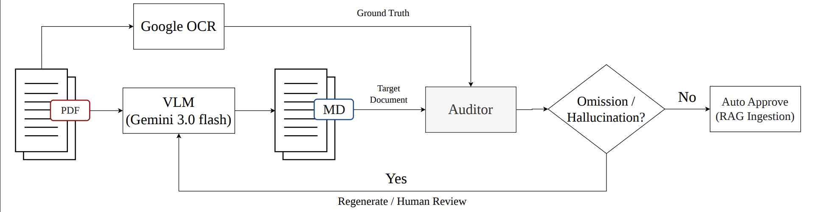

# Automated Document Auditor (ADA)
**_Pare Srirungpairoj, Panumate Chetprayoon, Kitsuchart Pasupa_**

---

> **Accepted at ICONIP 2026** - We release the benchmark dataset and the source code of the hybrid audit pipeline.

This repository contains the annotated benchmark dataset and the open-source code for the **Automated Document Auditor (ADA)**. The system is designed to evaluate the quality of PDF-to-Markdown conversions—specifically targeting Vision-Language Models (VLMs) like Gemini 3.0—for robust RAG (Retrieval-Augmented Generation) ingestion pipelines. 

This work is detailed in the paper: *"[Automated Document Auditor: Mitigating AI Hallucinations and Structural Omissions in PDF-to-Markdown Conversion](#)"*.

<div align="center">
  
  <p><em>Figure 1: The overall architecture of the Automated Document Auditor pipeline, comparing VLM-generated Markdown against OCR-extracted Ground Truth to prevent hallucinations and omissions in RAG ingestion.</em></p>
</div>

## Benchmark Dataset Details

The ADA benchmark dataset is specifically constructed to evaluate multimodal LLMs and document parsing tools on complex enterprise documents. The dataset comprises various Thai documents with different layout complexities. 

### Dataset Distribution (Open-Source Domain)
The dataset contains intentionally injected real-world AI errors to rigorously test the audit pipeline. The distribution of the annotated pages across the three main domains is as follows:

| Document Domain | Normal | Hallucination | Omission | Subtotal |
| :--- | :---: | :---: | :---: | :---: |
| **Text-Centric** | 100 | 50 | 50 | 200 |
| **Table-Centric** | 100 | 50 | 50 | 200 |
| **Vision-Centric** | 100 | 50 | 50 | 200 |
| **Total** | **300** | **150** | **150** | **600** |

*For raw document sources:*
- **Text-Centric** (Complex layouts, multi-column): Academic Papers [🔗 Source](#) and Royal Gazette. [🔗 Source](#)
- **Table-Centric** (Financial data, nested tables): Bank of Thailand [🔗 Source](#) and Stock Exchange Reports. [🔗 Source](#)
- **Vision-Centric** (Diagrams, charts): Architectural Diagrams [🔗 Source](#) and User Manuals. [🔗 Source](#)

### Data Structure & Annotations
The dataset provides complete end-to-end artifacts for full reproducibility:
- **`raw_markdown/`**: The complete, unsegmented original Correct Markdown documents.
- **`split_markdown/`**: The Correct Markdown data, segmented page-by-page in JSON format.
- **`preprocessing_artifacts/`**: Contains intermediate files including layout-aware visual masking bounding boxes (`extracted_images_metadata.json`) and baseline Google OCR data.
- **`benchmark_set/`**: The final dataset used for evaluation (`benchmark_input.json` and `ground_truth.json`). Each page is annotated according to the table above with specific classes: `ISSUE-Hallucination`, `ISSUE-Omission`, and `Normal`.

---

## Pipeline Features

Alongside the dataset, this repository provides the automated detection pipeline, featuring:
- **OCR Grounding:** Utilizes Google Cloud Vision API to extract highly accurate baseline text.
- **Semantic Alignment:** Employs Vertex AI (`text-multilingual-embedding-002`) to compute Cosine Similarity, comparing the *semantic meaning* of sentences rather than relying on exact keyword matches.
- **Image-Heavy Logic:** Adaptive scoring rules for pages with ≥ 15% image coverage to prevent false penalties caused by OCR limitations.

---

## Pipeline Workflow

The data flow from raw input to the final audit report:

```text
[Raw PDF] ──(Step 1)──> [Cleaned Images] + [Metadata] ──(Step 2)──> [Google OCR JSON]
                                                                           │
[Raw MD]  ──(Step 3)──> [Split MD JSON] ───────────────────────────────────┤
                                                                           ▼
                                                                        (Step 4)
                                                                           │
                                                                 [Final Audit Report]
```
### Processing Steps:

- **Step 1: Image Masking (`pdf_clean_img.py`)**
  - **Function:** Reads the raw PDF, extracts image bounding boxes (metadata), and visually masks images with white space to prevent non-textual noise from interfering with OCR.
  - **Input:** Raw PDF file.
  - **Output:** `cleaned_pages_for_ocr/` folder (masked page images) and `extracted_images_metadata.json` (extracted image data).

- **Step 2: Ground Truth Generation (`run_google_ocr.py`)**
  - **Function:** Generates Ground Truth by sending the masked images to Google Cloud Vision API to extract the highly accurate remaining text.
  - **Input:** Images from Step 1 (`cleaned_pages_for_ocr/`).
  - **Output:** `google_ocr.json` (text content organized page-by-page).

- **Step 3: Markdown Parsing (`split_md_pages.py`)**
  - **Function:** Reads the converted Markdown file and splits the content page-by-page relying on HTML comments (e.g., `<!-- Page 1 -->`).
  - **Input:** Raw Markdown file.
  - **Output:** `<filename>_split_md.json` (page-by-page structure ready for OCR comparison).

- **Step 4: Detection & Scoring (`detect_hallu_omiss.py`)**
  - **Function:** The core logic engine that compares and scores the data by processing outputs from Steps 1, 2, and 3.
  - **Input:** `google_ocr.json` (Ground Truth), `<filename>_split_md.json` (Markdown text), and `extracted_images_metadata.json` (image coordinates).
  - **Output:** `<filename>_final_report.json` specifying the evaluation status of each page (Pass, Fail, Review, Skipped).